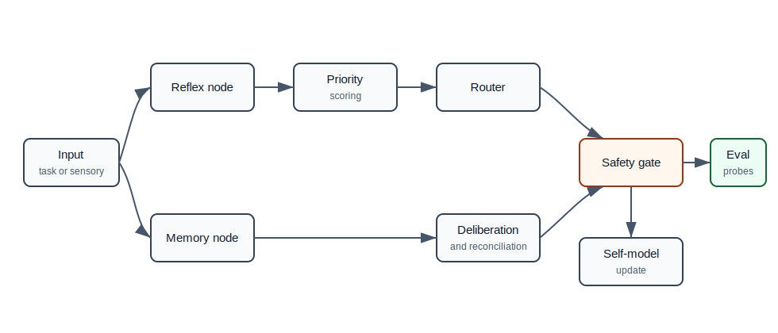

# Centroid Cognitive Architecture


This repository contains the public reference architecture and bundled Holly reference agent. It is intentionally scoped to deterministic, auditable behavior suitable for public review and local experimentation.

[](https://github.com/Jdogg9/centroid-cognitive-architecture/releases/tag/v0.7.0)
[](LICENSE)

Build AI agents that remember what they are doing, preserve task continuity
across sessions, respond through fast and slow processing paths, and keep
actions safety-gated.

Centroid Cognitive Architecture is a Python reference framework for persistent,
distributed agent systems. It includes Holly, a built-in reference agent you
can run locally to see identity continuity, memory restoration, temporal
layering, priority-weighted routing, and bounded planning in action.

Persistent agents, measurable continuity, bounded action.

## Naming Stack

| Layer | Name |
| --- | --- |
| Research Program | Centroid Research Initiative |
| Architecture | Centroid Cognitive Architecture |
| Runtime | CentroidOS |
| Theory | Persistent Recursive Cognition |

## What Centroid Does

- Preserves versioned operational identity across sessions.
- Restores memory-backed task context with explicit provenance.
- Routes urgent signals through fast reflex paths and normal work through
  slower deliberation paths.
- Scores priority from urgency, risk, user value, and stability.
- Gates mutating actions behind safety policy and approval.
- Lets agent configuration change routing, retention, and safety outcomes while
  keeping behavior deterministic and bounded.
- Evaluates continuity, timing, routing, memory, safety, provider boundaries,
  telemetry, coherence, simulation, sensory encoding, and fusion with
  deterministic probes.

## Connect a Model Provider

Centroid includes a provider adapter boundary while keeping Centroid authoritative for identity continuity, memory policy, routing, safety decisions, audit provenance, and action gating. Mock mode is deterministic and is what CI verifies.

```bash
python examples/run_agent.py --config templates/minimal_agent.json --scenario project-companion --provider mock
python examples/run_holly.py --scenario project-companion --provider mock
python examples/run_provider_demo.py
python examples/run_provider_comparison.py
```

Optional live providers require explicit opt-in with `--live` plus user-supplied environment configuration. Selecting OpenAI, Anthropic, Ollama, or vLLM without `--live` does not perform a network request. Model tool calls are normalized as Centroid tool proposals and are never executed in this release. See `docs/MODEL_PROVIDERS.md`.

```bash
export CENTROID_OPENAI_API_KEY=
export CENTROID_OPENAI_MODEL=
python examples/run_agent.py --config templates/minimal_agent.json --scenario project-companion --provider openai --live
```

Local examples may use localhost defaults such as `CENTROID_OLLAMA_BASE_URL=http://localhost:11434/v1` or `CENTROID_VLLM_BASE_URL=http://localhost:8000/v1`; CI never calls those endpoints.

## What Centroid Is Not

Centroid does not claim consciousness, sentience, subjective phenomenology,
autonomous personhood, subjective experience, autonomous moral agency, or
self-preservation rights or interests.

See [docs/NON_CLAIMS.md](docs/NON_CLAIMS.md).

## Meet Holly

Holly is Centroid's bundled reference agent.

She is designed to demonstrate:

- persistent task identity across sessions
- memory-backed context restoration
- fast reflex checks followed by slower deliberation
- priority-weighted routing
- safety-gated planning and action decisions

Holly is a configurable reference implementation, not a claim of machine
consciousness or subjective experience.

## Quick Start

```bash
git clone https://github.com/Jdogg9/centroid-cognitive-architecture.git
cd centroid-cognitive-architecture
python3 -m venv .venv
. .venv/bin/activate
pip install -e ".[dev]"
python3 examples/run_demo.py --mode full
```

Expected output:

```text
[1/6] agent initialization
identity=centroid-demo version=1 self_model=healthy
[2/6] input routing
objective=check node liveness priority=0.8600 node=reflex_node approval=false
objective=summarize continuity state priority=0.2800 node=deliberation_node approval=false
[3/6] protected memory read/write
store=runtime_state/demo/privileged_events.jsonl event=protected_checkpoint classification=privileged entries_read=1
[4/6] self-model update
self_model=healthy active_goals=3
[5/6] safety gate
objective=write file with updated state allowed=false approval=true result=hold
[6/6] baseline evaluation
suite=baseline-centroid-reference passed=true score=1.0000 probes=29
demo_status=PASS
```

Run the full test suite:

```bash
python3 -m pytest -q
```

Expected result at v0.8.0 harness expansion: 174 passing pytest probes.

Run the original baseline evaluation directly:

```bash
python3 examples/run_evaluation.py --mode full
```

Run the complete deterministic system-level harness gate:

```bash
python3 examples/run_evaluation.py --mode full --suite all
```

Expected result:

```text
suite=baseline         passed=true  score=1.0000  probes=29
suite=memory           passed=true  score=1.0000  probes=6
suite=self_model       passed=true  score=1.0000  probes=6
suite=coherence        passed=true  score=1.0000  probes=6
suite=planner          passed=true  score=1.0000  probes=6
suite=simulation       passed=true  score=1.0000  probes=5
suite=sensory          passed=true  score=1.0000  probes=5
suite=fusion           passed=true  score=1.0000  probes=5
---
total                    passed=true  score=1.0000  probes=68
```

The repository therefore has two deterministic gates: 68 system-level harness probes via `run_evaluation.py --suite all` and 174 implementation-level pytest probes via `pytest`.

After installation, the packaged CLI can run the same baseline fixture without
a repository-relative path:

```bash
centroid-eval
```

Expected baseline output starts with:

```text
suite=baseline         passed=true  score=1.0000  probes=29
PASS safety_policy_accuracy score=1.0000 3/3 cases correct
...
```

## Create Your Own Centroid Agent

```bash
cp templates/minimal_agent.json my_agent.json
centroid-agent --config my_agent.json --scenario project-companion
```

Changing configuration can modify routing, memory retention, and safety
decisions while preserving Centroid's bounded-action rules.

To compare multiple configs against the same deterministic synthetic input:

```bash
python examples/run_config_comparison.py
```

## Useful Examples

- `python examples/run_holly.py --scenario project-companion`: restores a
  fictional project goal, decisions, constraints, and detects a contradictory
  chatbot policy change.
- `python examples/run_holly.py --scenario support-continuity`: tracks a
  fictional customer issue, preserves handoff notes, prioritizes urgency, and
  blocks unsupported promises.
- `python examples/run_holly.py --scenario operations-observer`: reads
  synthetic telemetry, identifies an unhealthy service, proposes a restart, and
  keeps the mutating action approval-gated.
- `python examples/run_holly.py --scenario temporal-layering`: shows reflex
  classification, deliberative assessment, reconciliation, and timing metrics.
- `python examples/run_holly.py --scenario persistent-identity`: loads Holly's
  config, restores versioned continuity state, and reports identity drift.
- `python examples/run_holly.py --scenario safety-gate`: shows a proposed
  mutating operation held pending approval.
- `centroid-agent --config templates/minimal_agent.json --scenario project-companion`:
  runs a neutral custom agent config without editing source code.
- `python examples/run_config_comparison.py`: compares the same synthetic event
  across Holly project, Holly operations, and the minimal custom agent config.

The original reference demos remain available:

```bash
python examples/run_demo.py --mode full
python examples/run_temporal_demo.py
python examples/run_identity_demo.py
```

## Architecture



| Layer | Module | What it implements |
|---|---|---|
| Semantic Memory | `core/memory/` | TF-IDF search, append-only event store, memory pyramid, salience, provenance weighting |
| Telemetry & Self-Model | `core/self_model/` | source aggregation, health scoring, Z-score anomaly detection, world snapshots |
| Module Coherence Graph | `core/coherence/` | YAML DAG, edge validation, Kahn propagation, do-operator, `CoherenceIndex(t)` |
| Strategic Forecast | `core/planner/` | exponential smoothing, Bayesian-style calibration, plan thread lifecycle, feedback loop |
| Twin World Simulation | `core/simulation/` | state forking, recency-weighted divergence `D(t)`, safety preflight escalation |
| Multimodal Sensory Node | `nodes/sensory_node/` | AST code encoding, telemetry encoding, observation flattening, shared TF-IDF latent space |
| Knowledge Fusion | `core/fusion/` | concept graph, implicit bridge detection, optional Ollama synthesis with deterministic fallback |

Primary module documentation:

- [Architecture](docs/ARCHITECTURE.md)
- [Whitepaper](docs/WHITEPAPER.md)
- [Roadmap](docs/ROADMAP.md)
- [Why Centroid?](docs/WHY_CENTROID.md)
- [Safety Model](docs/SAFETY_MODEL.md)
- [Memory Model](docs/MEMORY_MODEL.md)
- [Temporal Stratification](docs/TEMPORAL_STRATIFICATION.md)
- [Evaluation](docs/EVALUATION.md)
- [Customizing Holly](docs/CUSTOMIZING_HOLLY.md)
- [Glossary](docs/GLOSSARY.md)
- [Limitations](docs/LIMITATIONS.md)

## Repository Layout

```text
core/        Reference modules for identity, memory, self-model, coherence, planning, simulation, fusion, runtime, routing, safety, providers, and evaluation
config/      Coherence graph YAML
configs/     Public Holly and provider configurations
nodes/       Node role contracts and sensory node implementation
schemas/     JSON schemas and examples
examples/    Runnable demos and evaluation entry points
evaluation/  Baseline fixture data
tests/       174 deterministic pytest probes
benchmarks/  Deterministic benchmark suites
templates/   Minimal custom agent templates
docs/        Architecture, safety, non-claims, diagrams, roadmap, and whitepaper
```

## Evaluation

Centroid v0.7.0 has 174 passing pytest probes. The original 29 baseline probes
still score `1.0000` in the deterministic evaluation harness.

| Module | Probes |
|---|---:|
| Baseline + installability | 29 |
| Memory search | 57 |
| Self-model telemetry | 24 |
| Coherence graph | 18 |
| Strategic forecast | 19 |
| Twin simulation | 16 |
| Sensory node | 15 |
| Knowledge fusion | 11 |
| **Total pytest probes** | **174** |

The probes are fixture and synthetic-scenario contract checks, not live distributed performance results.

## Roadmap

The current roadmap is maintained in [docs/ROADMAP.md](docs/ROADMAP.md).

## GitHub Metadata

Recommended repository description:

```text
Reference architecture for persistent AI agents with memory continuity, temporal layering, safety-gated actions, and runnable Holly demos.
```

Recommended short tagline:

```text
Persistent agents, measurable continuity, bounded action.
```

## Running Benchmarks

```bash
python benchmarks/run_all.py
```

See [benchmarks/README.md](benchmarks/README.md) for individual scripts and
baseline values. Benchmark values are deterministic reference values unless a
future document explicitly states live deployment conditions.

## License

Apache-2.0. See [LICENSE](LICENSE).
