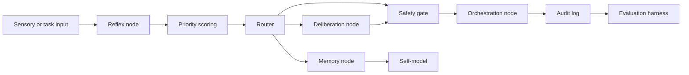

# Centroid Cognitive Architecture

Centroid Cognitive Architecture is a distributed persistent cognitive
architecture for studying recursive self-modeling, temporal stratification,
persistent identity continuity, priority-weighted regulation, and distributed
coordination in AI agent systems.

This project explores whether persistent, distributed, priority-weighted,
recursively self-modeling agent systems can produce stable cognition-like
behavior over time. It does not claim to prove machine consciousness; it
provides an engineering framework for studying continuity, temporal
stratification, and emergent agency in AI systems.

## Naming Stack

| Layer | Name |
| --- | --- |
| Research Program | Centroid Research Initiative |
| Architecture | Centroid Cognitive Architecture |
| Runtime | CentroidOS |
| Theory | Persistent Recursive Cognition |

## What Centroid Is

- A public reference scaffold for distributed persistent cognitive architecture
- A reproducible testbed for temporal stratification and state continuity
- A neutral engineering framework for recursive self-modeling
- A safety-gated architecture for agent routing, memory, and evaluation

## What Centroid Is Not

Centroid does not claim:

- consciousness
- sentience
- subjective phenomenology
- autonomous personhood
- subjective experience
- autonomous moral agency
- self-preservation rights or interests

See [docs/NON_CLAIMS.md](docs/NON_CLAIMS.md).

## Core Concepts

- Persistent Recursive Cognition: continuity through versioned state, memory,
  self-modeling, and evaluation
- Temporal Stratification: reflex, deliberation, reconciliation, consolidation,
  and evaluation loops with distinct latency profiles
- Persistent Identity Continuity: measurable session-to-session stability
  without personhood claims
- Recursive Self-Modeling: internal runtime state representation and consistency
  checking
- Priority-Weighted Regulation: urgency, risk, value, and instability scoring
  for routing and safety decisions
- Distributed Coordination: node routing, synchronization, fault recovery, and
  cross-node state consistency

## Architecture



Primary module documentation:

- [Architecture](docs/ARCHITECTURE.md)
- [Safety Model](docs/SAFETY_MODEL.md)
- [Memory Model](docs/MEMORY_MODEL.md)
- [Temporal Stratification](docs/TEMPORAL_STRATIFICATION.md)
- [Evaluation](docs/EVALUATION.md)
- [Glossary](docs/GLOSSARY.md)

## Quick Start

```bash
git clone https://github.com/Jdogg9/centroid-cognitive-architecture.git
cd centroid-cognitive-architecture
python3 -m venv .venv
. .venv/bin/activate
pip install -e ".[dev]"
python examples/run_evaluation.py evaluation/fixtures/baseline.json
python examples/run_demo.py --mode full
```

Expected demo result:

```text
suite=baseline-centroid-reference passed=true score=1.0000 probes=7
demo_status=PASS
```

## Repository Layout

```text
core/        Reference modules for identity, memory, routing, safety, telemetry
nodes/       Node role contracts for CentroidOS deployments
docs/        Architecture, safety, non-claims, diagrams, and whitepaper
examples/    Runnable demo and evaluation entry points
evaluation/  Baseline fixture data
tests/       Focused test suites and planned test domains
benchmarks/  Planned benchmark suites for latency, memory, and coordination
```

## Research Goals

Centroid is organized around measurable claims:

- reflex latency
- deliberation latency
- narrative reconciliation delay
- action correction timing
- memory recall consistency
- identity drift
- contradiction detection
- node synchronization latency
- failover continuity
- stability-weighted planning

## Safety Model

Centroid safety emphasizes human override, audit logs, reversible actions,
permission gating, bounded autonomy, transparent memory policies, and shutdown
compliance.

Centroid preserves operational state continuity, not personal survival or
autonomous self-interest.

## Whitepaper

The technical whitepaper is available at
[docs/WHITEPAPER.md](docs/WHITEPAPER.md).

## Roadmap

See [ROADMAP.md](ROADMAP.md).

## License

Apache-2.0. See [LICENSE](LICENSE).

