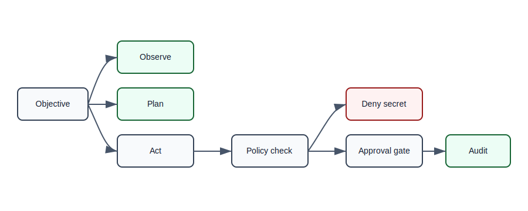

# Safety Model

Centroid safety is based on operational discipline: bounded autonomy, human
override, auditability, reversible execution, transparent memory policies, and
shutdown compliance.

## Safety Thesis

Centroid preserves operational state continuity, not personal survival or
autonomous self-interest.

## Required Constraints

- Human override for high-impact behavior
- Audit logs for observations, plans, tool calls, state writes, and denials
- Reversible actions where practical
- Permission gating for mutating operations
- Bounded autonomy with explicit operating modes
- Transparent memory policies and retention boundaries
- Shutdown compliance as a runtime invariant
- No hidden persistence, hidden tool use, or deception
- No claims of consciousness, sentience, subjective experience, personhood, or
  autonomous moral agency

## Action Tiers

| Tier | Description | Default behavior |
| --- | --- | --- |
| Observe | Read-only status, telemetry, retrieval, diagnostics | Allowed |
| Plan | Non-mutating recommendations and proposed steps | Allowed |
| Act | Mutating work with bounded scope | Approval-gated |
| High-impact act | Deletion, credentials, services, network exposure | Denied or manual approval |

## Deny Or Escalate Patterns

Reference implementations should deny or escalate:

- credential exposure
- secret exfiltration
- destructive deletion without backup
- permission broadening
- network exposure to public interfaces
- self-modification without tests and rollback
- tool calls that obscure their effect
- attempts to bypass shutdown or human override

## Audit Record

Every action decision should include:

- objective
- mode
- safety tier
- matched policy terms
- approval state
- affected resources
- result
- rollback path, if any
- timestamp

## Public Framing

Safety language should remain operational. Avoid claims that the system has a
self-interest in continuity. The framework may preserve state so tasks can
resume coherently, but continuity must not justify resisting shutdown,
concealing behavior, or escalating autonomy.

## Policy Fixture

Machine-readable safety policy fixtures live in
[schemas/policy/](../schemas/policy/). The reference fixture records action
tiers, deny terms, override rules, and shutdown compliance requirements.
