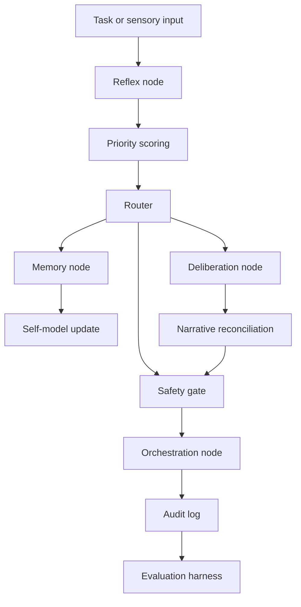

# Architecture Flow

```mermaid
flowchart TD
    Input[Task or sensory input] --> Reflex[Reflex node]
    Reflex --> Priority[Priority scoring]
    Priority --> Router[Router]
    Router --> Memory[Memory node]
    Router --> Deliberation[Deliberation node]
    Router --> Safety[Safety gate]
    Memory --> SelfModel[Self-model update]
    Deliberation --> Reconcile[Narrative reconciliation]
    Reconcile --> Safety
    Safety --> Orchestration[Orchestration node]
    Orchestration --> Audit[Audit log]
    Audit --> Evaluation[Evaluation harness]
```
