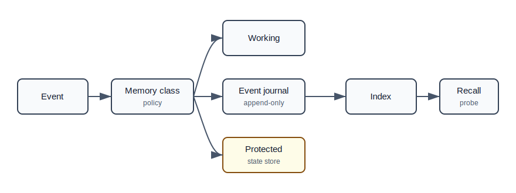
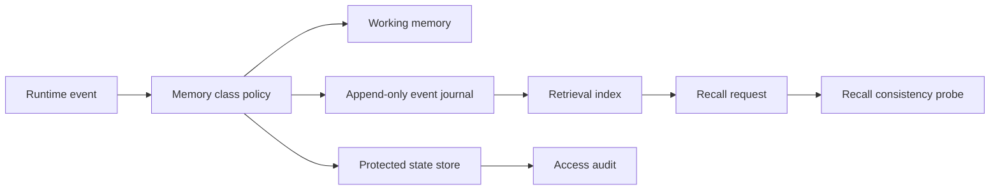

# Memory Flow

```mermaid
flowchart LR
    Event[Runtime event] --> Classifier[Memory class policy]
    Classifier --> Working[Working memory]
    Classifier --> Journal[Append-only event journal]
    Classifier --> Protected[Protected state store]
    Journal --> Index[Retrieval index]
    Protected --> Audit[Access audit]
    Index --> Recall[Recall request]
    Recall --> Evaluation[Recall consistency probe]
```
