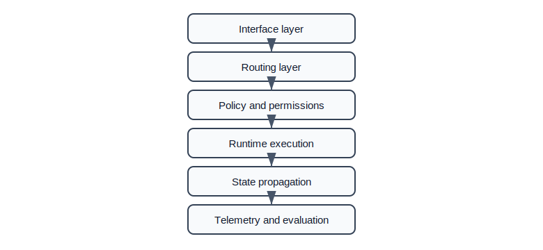
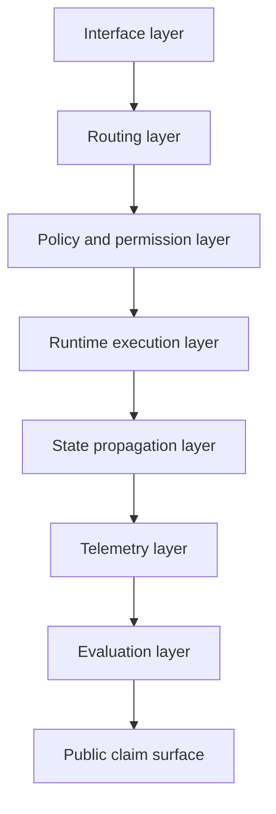

# Orchestration Layers

```mermaid
flowchart TD
    Interface[Interface layer] --> Router[Routing layer]
    Router --> Policy[Policy and permission layer]
    Policy --> Runtime[Runtime execution layer]
    Runtime --> State[State propagation layer]
    State --> Telemetry[Telemetry layer]
    Telemetry --> Evaluation[Evaluation layer]
    Evaluation --> Docs[Public claim surface]
```

The orchestration node coordinates routing, permission gates, state updates,
audit logs, telemetry emission, and evaluation hooks.
