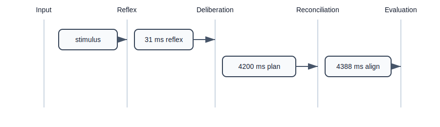
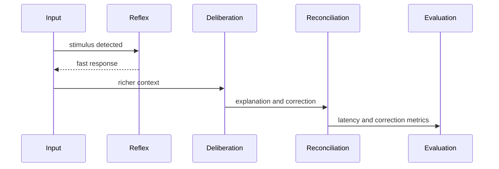

# Timing Flow

```mermaid
sequenceDiagram
    participant Input
    participant Reflex
    participant Deliberation
    participant Reconciliation
    participant Evaluation

    Input->>Reflex: stimulus detected
    Reflex-->>Input: fast response
    Input->>Deliberation: richer context
    Deliberation->>Reconciliation: explanation and correction
    Reconciliation->>Evaluation: latency and correction metrics
```
